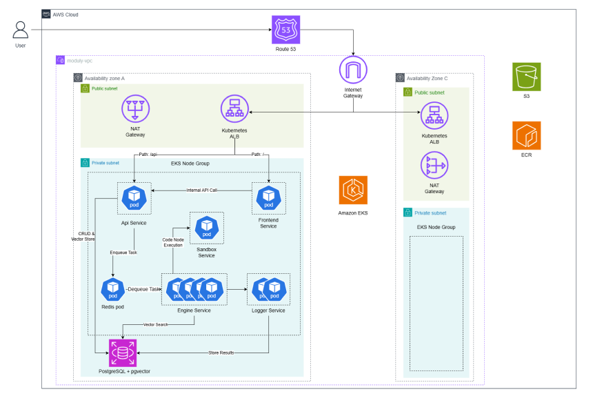

# Moduly (모듈리)

<div align="center">

 

**복잡한 설정 없이 완성하는 가장 직관적인 AI 자동화 툴**
<br/>
Drag & Drop으로 나만의 AI 워크플로우를 설계하고 실행하세요.

[](https://opensource.org/licenses/MIT)
[](https://python.org)
[](https://nextjs.org)
[](https://www.docker.com/)

[SaaS 체험하기](https://moduly-ai.cloud/) · [설치 가이드](#getting-started) · [버그 제보](https://github.com/jungle-scope/moduly/issues)

</div>

---

## Introduction

**Moduly**는 개발자와 비개발자 모두를 위해 설계된 오픈소스 AI 자동화 플랫폼입니다. 기존의 자동화 툴들이 가진 높은 진입 장벽과 복잡한 설정을 제거하고, 직관적인 드래그 앤 드롭 인터페이스를 통해 누구나 강력한 AI 워크플로우를 구축할 수 있도록 돕습니다.

단순한 챗봇을 넘어, 외부 데이터(RAG), API 연동, 그리고 파이썬 코드 실행까지 하나의 캔버스 위에서 자유롭게 연결하세요. Moduly가 당신의 아이디어를 실행 가능한 **모듈**로 만듭니다.

## Key Features

*   **드래그 앤 드롭 워크플로우**: 복잡한 코딩 없이 노드를 연결하여 로직을 설계하는 직관적인 UI/UX.
*   **강력한 RAG (Retrieval-Augmented Generation)**: 문서, 데이터베이스 등 다양한 소스의 데이터를 학습시켜 AI가 더 똑똑하게 답변하도록 지식 베이스를 연결.
*   **안전한 코드 실행 환경**: `NSJail` 기반 샌드박스 환경에서 Python 코드를 실행할 수 있는 안전한 환경.
*   **폭넓은 확장성**: HTTP Request, Email(IMAP) 등 다양한 외부 서비스와의 데이터 동기화 및 연동 지원.
*   **셀프 호스팅 최적화**: Docker Compose 하나로 프론트엔드부터 백엔드, DB까지 로컬 환경에 즉시 배포.

## Getting Started

로컬 환경에서 Moduly를 실행하는 두 가지 방법이 있습니다:
- **Docker Compose**: 로컬 또는 단일 서버에서 빠른 설치
- **Kubernetes (Helm)**: 프로덕션 환경을 위한 확장 가능한 배포

### Option 1: Docker Compose

#### Prerequisites
*   [Docker](https://www.docker.com/) & Docker Compose
*   Git

#### Installation

1. **저장소 클론**
   ```bash
   git clone https://github.com/jungle-scope/moduly.git
   cd moduly
   ```

2. **환경 변수 설정**
   제공된 예제 파일을 복사하여 `.env` 파일을 생성합니다.
   ```bash
   cp .env.example .env
   ```
   *`.env` 파일을 열어 `OPENAI_API_KEY`나 `ENCRYPTION_KEY` 등 필요한 키 값을 입력하세요.*

3. **Docker 서비스 실행**
   ```bash
   docker-compose up -d --build
   ```
   *최초 실행 시 이미지를 빌드하느라 시간이 조금 걸릴 수 있습니다.*

4. **접속**
   브라우저를 열고 `http://localhost`으로 접속하여 Moduly를 시작하세요.
   API 문서는 `http://localhost/api/docs`에서 확인할 수 있습니다.

### Option 2: Kubernetes (Helm)

Kubernetes 클러스터에 프로덕션 수준의 배포를 원한다면 Helm 차트를 사용하세요.

#### Prerequisites
*   Kubernetes 클러스터 (v1.24+)
*   [Helm](https://helm.sh/) (v3.0+)
*   [kubectl](https://kubernetes.io/docs/tasks/tools/)

#### Installation

1. **저장소 클론**
   ```bash
   git clone https://github.com/jungle-scope/moduly.git
   cd moduly
   ```

2. **의존성 업데이트**
   ```bash
   cd infra/helm/moduly
   helm dependency update
   ```

3. **values.yaml 생성 및 설정**
   ```bash
   helm show values ./infra/helm/moduly > values.yaml
   ```
   
   생성된 `values.yaml` 파일을 수정하여 환경에 맞게 구성합니다:
   - 이미지 태그
   - 도메인 설정 (ingress)
   - 스토리지 클래스
   - 리소스 제한
   - 환경 변수 (API 키 등)

4. **Helm 차트 설치**
   ```bash
   helm upgrade --install moduly ./infra/helm/moduly -f values.yaml
   ```

5. **배포 확인**
   ```bash
   kubectl get pods -n moduly
   kubectl get ingress -n moduly
   ```

   설정한 도메인으로 접속하거나 Ingress IP를 확인하여 접속하세요.

> **참고**: 자세한 Helm 차트 설정은 `infra/helm/moduly/README.md`를 참고하세요.

### 환경변수

주요 환경 변수 예시입니다. (자세한 내용은 `.env.example` 참고)

| 변수명 | 설명 | 기본값/예시 |
|--------|------|-------------|
| `NEXT_PUBLIC_API_UR` | 백엔드 API 주소 | `http://localhost:8000` |
| `ENCRYPTION_KEY` | 민감 데이터 암호화 키 | (Random String) |
| `REDIS_URL` | Redis 접속 주소 | `redis://redis:6379/0` |
| `POSTGRES_USER` | DB 사용자명 | `moduly` |

## Architecture


## Tech Stack

Moduly는 최신 기술 스택을 활용하여 안정성과 확장성을 보장합니다.

### **Frontend**
*   **Framework**: Next.js 16 (TypeScript)
*   **Styling**: Tailwind CSS
*   **Components**: React Flow (노드 기반 UI), Shadcn UI

### **Backend (Workflow Engine)**
*   **Language**: Python 3.11
*   **Core**: Celery
*   **Database**: SQLAlchemy 2.0(ORM), Redis (Message Broker & Caching)
*   **AI Core**: LiteLLM (LLM Abstraction), PyMuPD, LlamaParse, pgvector

### **Infrastructure**
*   **Containerization**: Docker, Docker Compose - 로컬 개발 환경
*   **Kubernetes + Helm** - 프로덕션 오케스트레이션
*   **Terraform** - 인프라 프로비저닝
*   **NSJail** - 코드 샌드박스 격리
*   **CI/CD**: GitHub Actions

## Project Structure

```
moduly/
├── apps/                    # 마이크로서비스 애플리케이션
│   ├── client/             # Next.js 프론트엔드
│   ├── gateway/            # FastAPI 게이트웨이 (API 서버)
│   ├── workflow_engine/    # Celery 워크플로우 엔진 (작업 처리)
│   ├── sandbox/            # NSJail 코드 실행 환경
│   ├── log_system/         # 로그 수집 및 처리 시스템
│   └── shared/             # 공통 라이브러리 (DB, 유틸리티)
├── infra/                   # 인프라 설정
│   ├── helm/               # Kubernetes Helm 차트
│   ├── k8s/                # Kubernetes 매니페스트
│   └── terraform/          # Terraform 인프라 코드
├── docker/                  # Docker 설정
│   ├── docker-compose.yml  # 로컬 실행 용 compose 파일
│   └── */                  # 각 서비스별 Dockerfile
├── scripts/                 # 빌드 및 배포 스크립트
├── tests/                   # 테스트 코드
└── docs/                    # 문서 및 이미지
```

## How to use

1. **새 프로젝트 생성**: 내 모듈에서 '새 모듈'를 클릭합니다.
2. **노드 추가**: 좌측 패널에서 원하는 노드를 캔버스로 드래그하거나 에디터에서 오른쪽 마우스를 클릭합니다.
3. **연결**: 각 노드의 핸들을 마우스로 끌어 흐름을 연결합니다.
4. **설정**: 노드를 클릭하여 프롬프트를 입력하거나 API 설정을 마칩니다.
5. **실행**: 캔버스 상단 "테스트" 버튼으로 워크플로우 테스트
6. **배포** — 완성된 워크플로우를 배포

## Roadmap
Moduly의 향후 개발 계획입니다:

*   [ ]  **다국어 UI** — 영어, 일본어 등 다국어 지원
*   [ ] **엔터프라이즈 기능** — SSO, RBAC, 감사 로그
> 아이디어가 있으신가요? [Ideas](https://github.com/jungle-scope/moduly/discussions/categories/ideas)에 남겨주세요! 🙌

## Contributing

Moduly는 오픈소스 커뮤니티의 참여를 환영합니다! 버그 수정, 기능 추가, 문서 개선 등 어떤 형태의 기여도 감사합니다.

- 기여하기 전에 [CONTRIBUTING.md]([./CONTRIBUTING.md](https://github.com/jungle-scope/moduly/wiki/CONTRIBUTING#%EC%BD%94%EB%93%9C-%EC%8A%A4%ED%83%80%EC%9D%BC))를 읽어주세요
- 모든 참여자는 [행동 강령](https://github.com/jungle-scope/moduly/wiki/Contributor-Covenant-%ED%96%89%EB%8F%99-%EA%B0%95%EB%A0%B9)을 준수해 주세요
- 보안 취약점 발견 시 [SECURITY.md](https://github.com/jungle-scope/moduly/wiki/%EB%B3%B4%EC%95%88-%EC%A0%95%EC%B1%85)를 참고해 주세요

## License

이 프로젝트는 [MIT License](./LICENSE)를 따릅니다. 자유롭게 사용, 수정 및 배포가 가능합니다.

---
<div align="center">
  Made with ❤️ by the Moduly Team
</div>
